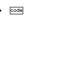

 

**A universal programming language**

## Summary
Unilang is a programming language and IDE.  It has a graphical and textual fronted for creating programs.  The language unifies with other languages through transcompilation.  It was written to improve the quality of software by allowing a paradigm of rich data annotation.  It was also designed to make developing software more fun.  

## GPL Shortcomings
Despite their name, **general-purpose programming languages (GPLs)** become associated with specific niches that target particular programming domains.  Due to the differences between these languages (both internal and external to their design), evaluations on the problem space lead to different languages being chosen.  A cross-domain problem is then solved through a mixture of languages.  Under such circumstances, individual GPLs have not proven general enough as the solution to the entire problem space.  Unilang's stance is that the amalgamation of different languages could be an implementation detail below a more conceptually pure representation of the full problem ontology.  We consider different languages within the same ontology to be less productive for establishing insight and enabling code evolution.  It is better to have the entire problem space of software encoded from the same unifying model, otherwise system-wide reflexivity becomes untenable.  A unifying language can operate as a transcompiler to other existing GPLs as needed.  

## Design
The creation of this language is different from traditional programing languages because it rejects using lexical analysis for syntax conformance and language grammars for semantic conformance.  The solidification of a language frontend can be achieved without tokenization toward gramatical AST construction.  Programming in Unilang is the declarative encoding of concept values to a language's meta-model.  This avoids the typical transformation process where syntactical expressions are parsed into ASTs; a strategy that seems to lose the pragmatic meaning from the originally intended encoded information.  An example of this issue can be more widely seen if we reflect on the usefulness of compiler errors.  A large amount of effort has gone into trying to make error messages as clear as possible, but often times there still remains a clarity gap that could be filled.  By any means, why should the programmer be capable of making syntactical mistakes in the first place?  Projectional editing can solve this.  A longer description for the rationale around Unilang's design is covered in the remaining subsections.  

